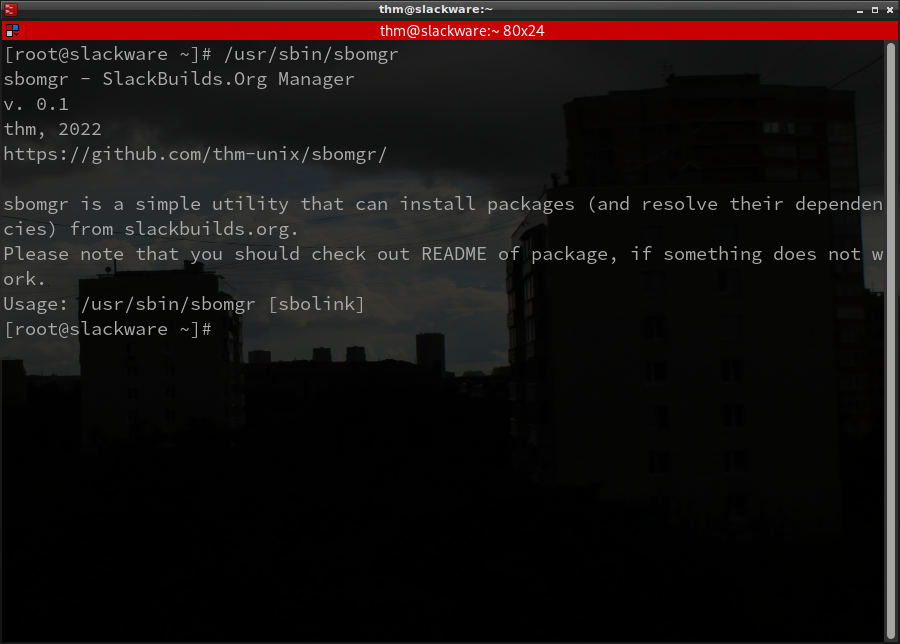

# sbomgr - SlackBuilds.Org Manager
sbomgr is a simple utility that can install packages (and resolve their dependencies recursively) from slackbuilds.org.
! Please note that you should check out README of package, if something goes wrong.

# Usage
/usr/sbin/sbomgr [link]

[link] - https://slackbuilds.org/repository/[version]/[category]/[pkg]/ <br>
i.e. https://slackbuilds.org/repository/15.0/development/notepadqq/

# Installation
```git clone https://github.com/thm-unix/sbomgr```

```cd sbomgr```

```pip3 install -r requirements.txt```

```cp sbomgr.py /usr/sbin/sbomgr```

# Screenshots

